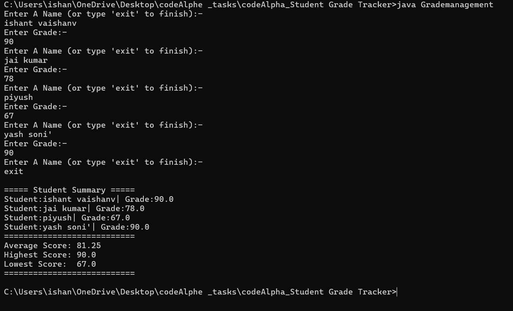

# Student Grade Tracker

A simple **console-based Student Grade Tracker** developed in **Java** as part of my **Java Programming **.

The application allows users to enter multiple student names and grades, then automatically generates a summary showing all students along with the average, highest, and lowest scores.

---

## 📌 Features

- ➕ Add multiple students
- 📝 Store student names and grades
- 📊 Calculate average grade
- 🏆 Find the highest score
- 📉 Find the lowest score
- 📋 Display a complete student summary
- 🚪 Exit the program anytime by typing `exit`

---

## 🛠 Technologies Used

- Java
- Object-Oriented Programming (OOP)
- ArrayList
- Arrays
- Scanner Class

---

## 📂 Project Structure

```
Student Grade Tracker/
│
├── Grademanagement.java
├── Student.java
├── README.md
└── screenshot.png
```

---

## ▶️ How to Run

### Clone the repository

```bash
git clone https://github.com/your-username/Student_Grade_Tracker.git
```

### Compile

```bash
javac *.java
```

### Run

```bash
java Grademanagement
```

---

## 💻 Sample Output

```
Enter A Name (or type 'exit' to finish):
Ishant

Enter Grade:
90

Enter A Name (or type 'exit' to finish):
Jai Kumar

Enter Grade:
78

Enter A Name (or type 'exit' to finish):
exit

===== Student Summary =====

Student: Ishant | Grade: 90.0
Student: Jai Kumar | Grade: 78.0

===========================
Average Score: 84.00
Highest Score: 90.0
Lowest Score : 78.0
===========================
```

---

## 📸 Screenshot



---

## 📚 Java Concepts Used

- Classes & Objects
- Constructors
- Encapsulation
- ArrayList
- Arrays
- Loops
- Conditional Statements
- User Input Handling
- Basic Data Analysis

---

## 🚀 Future Improvements

- Update student grades
- Delete student records
- Search student by name
- Assign letter grades (A, B, C, D, F)
- Save records to a file
- Sort students by marks
- Display student rankings
- Add a menu-driven interface

---

## 👨‍💻 Author

**Ishant Vaishnav**

- 🎓 BCA Student
- ☕ Java Developer
- 💻 Learning Data Structures & Algorithms

---
## ⭐ Support

If you found this project helpful, consider giving this repository a **⭐ Star** on GitHub.
